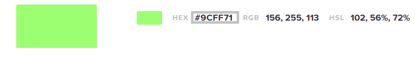
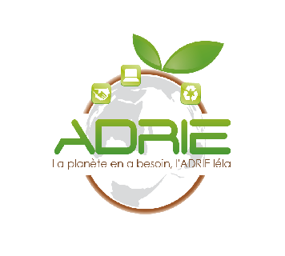

# Application ADRIE

Bienvenue sur l'application ADRIE, une application "carnet de bord apprenant". 

## Users stories 

| En tant que  |  je veux | afin de | critères d'acceptations |
|--|--|--|---------|
|Apprenant | accèder à mes heures de présence/absence | pouvoir justifier une absence | Afficher les absences | 
|Apprenant|pouvoir envoyer un justificatif d'absence | d'annuler une absence | Envoyer un mail à l'admin |
|Admin|créer des comptes apprenants | que les apprenants puissent se connecter | Enregistrer les données du compte dans la BDD | 
|Admin|créer des comptes formateurs | que les formateurs puissent se connecter | Enregistrer les données du compte dans la BDD |
|Admin|créer les promotions | d'affecter les apprenants à une promotion | Enregistrer les données du compte dans la BDD |
|Admin|associer une promotion à des apprenants|lister les apprenants de la promotion|Créer un lien entre une promotion et des apprenants  | 
|Admin|associer un tuteur et ses apprenants | que le tuteur puisse voir la liste d'apprenants|Créer un lien tuteur et apprenant|
|Admin|modifier l'emploi du temps|pouvoir gérer les changements ou les absences d'un formateur | CRUD |
|Admin|modifier les données d'un compte|modifier des données fausses|CRUD|
| Tuteur |voir les heures de présence/absence de mes apprenants | vérifier si ils sont assidus| Afficher la liste des apprenants et leur nombre d'heures de présence/absence|
|Tuteur|voir l'historique depuis entrée en formation | pouvoir les suivre depuis le début et ne rien manquer | Afficher chaque jour et voir si l'apprenant a été absent ou pas| 

## Charte Graphique 

Les couleurs figurant sur le logo de l'ADRIE sont utilisées. 

### Vert foncé  #61a444

Il représente la stabilité et l'équilibre.

### Vert clair #9cff71

Résultat de recherche d'images pour "vert clair signification"
Couleur de l'espérance, le vert est porteur de chance. Il invite au calme et au repos.

### Logos 

 

## Liens 

Wireframe : https://www.figma.com/file/X6LAkTmoHSNxezwnLw4TgY/APRUN?node-id=0%3A1

Méthode Kanban : https://trello.com/b/t45zuHkj/aprun

